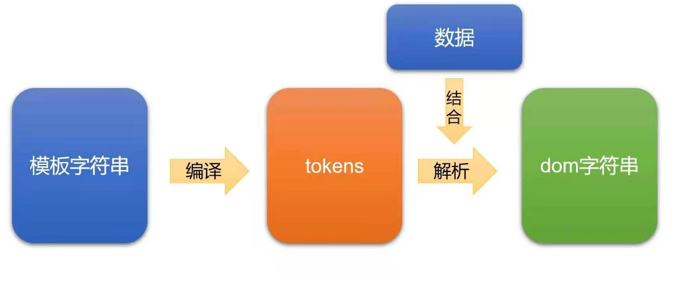

#  vue模板引擎

## 什么是模板引擎

*  模板引擎是**将数据变为视图**最优雅的解决方案

##  将数据变为视图的方法

* 纯dom：
  * 非常笨拙，没有实战价值
* 数组join方法：
* ES6反引号法：
  * ES6中新增的**`${a}`语法糖**，很好用

* 模板引擎：
  * **将数据变为视图最优雅**的解决方法

##  mustache

* mustache是最早的模板引擎库

* 嵌入标记
  * **{{}}**

##  mustache的基本使用

* 引入mustache库
* **{{#** 数据中需要循环的数据**}}**开始循环  **{{/** 数据中需要循环的数据...**}}**循环结束

##  mustache循环对象数组

* `Mustache.render(模板字符串，数据)`

##  mustache底层机理



* mustache库底层重点要做两件事：
  * **将模板字符串编译未tokens形式**
  * **将tokens结合数据，解析为dom字符串**

## 什么是tokens


* 如上图所示：标签与纯文字部分会被当作“text”,**{{}}**中的数据被解析为"name"(token的个数就是这样划分的)
* tokens是一个**JS的嵌套数组**,就是**模板字符串的JS表示**
* 它是**“抽象语法树”、“虚拟节点”**等的鼻祖

##  循环情况下的tokens


* 当模板字符串中有循环存在时，它将被编译为**嵌套更深的tokens**

##  手写mustache

* `npm init` 

* 新建一个webpack.config.js文件，配置环境

  ```json
  const path = require('path');
  
  module.exports = {
  // 模式
    mode:'development',
  //   入口
    entry: './src/index.js',
  //   出口(打包到什么文件中)
    output: {
      //   虚拟的文件
      filename: 'bundle.js' 
    },
  //   配置webpack-dev-server
    devServer: {
      //   静态文件根目录
      contentBase: path.join(__dirname, "www"),
      // 不压缩
      compress: false,
      // 端口号
      port: 8080,
      // 虚拟打包路径，bundle.js没有真正的生成
      publicPath:"/xuni/"
    }
  };
  ```

* 在静态文件根目录www里面新建index.html

  ```html
      <!-- 引入虚拟打包文件 -->
      <!-- 这就是这个项目中要暴露的东西 -->
      <script src="/xuni/bundle.js"></script>
      <h1>您好</h1>
      <script>
          // 模板字符串
          let templateStr = '我是{{name}}，今年{{age}}岁了'
          // 数据
          let data = {}
          // 调用render函数
          myTemplateEngine.render(templateStr,data)
      </script>
  ```

##  Scanner类

* scan函数与scanUtil函数的作用

  * 

* Scanner.js

  ```javascript
  /* 
      扫描器的类
  */
  export default class Scanner {
      constructor(templateStr) {
          // 当前的指针
          this.pos = 0
          // 字符串的尾巴（包括当前指针以及后面的字符串,一开始没有扫描就是整个字符串）
          this.tail = templateStr
          // 将模板字符串写到实例上
          this.templateStr = templateStr
      }
      //    scan用于扫描{{ 或  }}
      // 也就是说，用于指定走过类容，没有返回值
      scan(tag) {
          if (this.tail.indexOf(tag) == 0) {
              // tag有多长，就让指针后移多少位
              this.pos += tag.length
              this.tail = this.templateStr.substring(this.pos)
          }
      }
      //    scanUtil用于扫描字符串
      // 也就是说，让指针进行扫描，直到遇见指定内容结束，并返回结束之前路过的文字
      scanUtil(stopTag) {
          // 记录一下执行该方法的时候pos的值
          const pos_backup = this.pos
          // 当尾巴的开头怒视stopTag的时候，就说明还没有扫到stopTag
          while (!this.eos()&&this.tail.indexOf(stopTag) != 0) {
              this.pos++
              // 从当前指针到字符串结束
              this.tail = this.templateStr.substring(this.pos)
          }
          // substring含头不含尾部
          return this.templateStr.substring(pos_backup, this.pos)
      }
      // 判断指针是否到头的函数
      eos() {
          return this.pos >= this.templateStr.length
      }
  }
  
  ```

* index.js

  ```javascript
  // 引入Scanner类
  import Scanner from './Scanner'
  // 全局提供myTemplateEngine对象
  window.myTemplateEngine = {
      // 渲染方法
      render(templateStr, data) {
          /*
           1、将模板字符串编译为tokens
              1.1寻找双大括号
              实例化一个扫描器，构造的时候提供一个参数，这个参数就是模板字符串
              也就是说这个扫描器时针对模板字符串工作的
           */
          let scanner = new Scanner(templateStr)
          // 当scanner没有到头
          while (!scanner.eos()) {
              // 扫描大括号
              let returnWords = scanner.scanUtil('{{')
              console.log(returnWords)
              // 度过大括号
              scanner.scan('{{')
              returnWords = scanner.scanUtil('}}')
              console.log(returnWords)
              scanner.scan('}}')
          }
  
      },
  }
  ```

  

##  嵌套tokens的编写


* `#`与`/`之间的内容又是一个token内容

##  栈

* **先进后出**
* 当遇到`#`的时候就入栈，遇到`/`的时候就出栈

